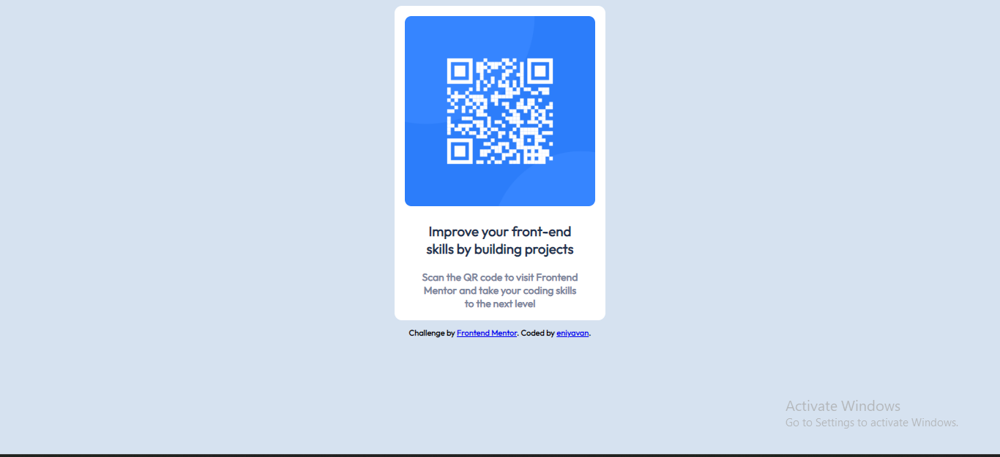

eep.**

## Overview

### Screenshot

### Links

- Solution URL: [Add solution URL here](https://your-solution-url.com)
- Live Site URL: [Add live site URL here](https://your-live-site-url.com)

## My process
first i create html skeleton and class for my div 
second change the weight and margin of that div and also border radius of that div
next change the width and height of that QR img and border radius of that img
next change the color of the h3 and p tags and also add some padding to that

### Built with

- Semantic HTML5 markup
- CSS custom properties

### What I learned

i felt only hard in alignment an items and i learn if i put align-items center for elements it align all items center inside it 

## Author

- Website - [eniyavan](https://www.your-site.com)
- Frontend Mentor - [@easyera](https://www.frontendmentor.io/profile/easyera)

